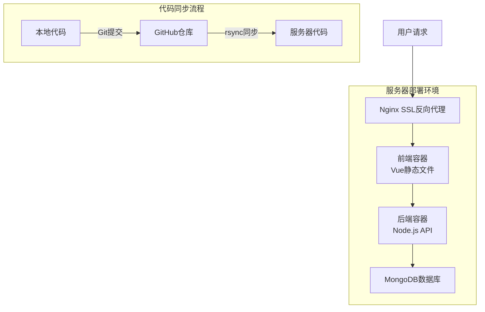

## 产品概述

制定服务器三地同步更新计划，确保本地、GitHub和线上服务器的代码完全一致，解决当前存在的未提交修改和待同步记录问题。

## 核心功能

1. **代码差异分析**：全面分析本地、GitHub、服务器三地代码差异，识别所有待同步的修改
2. **本地清理与提交**：清理临时文件，提交所有未提交的本地修改到Git仓库
3. **GitHub同步**：推送本地提交到GitHub远程仓库，确保本地与GitHub代码一致
4. **线上安全部署**：遵循安全铁律进行数据库备份、代码同步和容器重建
5. **部署验证**：验证网站可访问性、API功能和页面显示，确保功能正常

## 技术栈选择

- **前端框架**：Vue 3 + Composition API + TypeScript（复用现有项目技术栈）
- **UI组件库**：Element Plus（项目现有组件库）
- **构建工具**：Vite（项目现有构建工具）
- **后端框架**：Node.js + Express + Mongoose（项目现有后端技术栈）
- **数据库**：MongoDB 7.0.31（线上生产环境）/ MongoDB 8.2.6（本地开发环境）
- **部署架构**：Docker + Nginx + Docker Compose（项目现有部署架构）
- **版本控制**：Git + GitHub（项目现有版本控制系统）

## 实现方法

### 总体策略

采用分阶段、安全可控的部署策略：

1. **分析阶段**：使用[subagent:code-explorer]深度分析三地代码差异，生成详细报告
2. **本地阶段**：清理临时文件，提交未提交修改，确保本地代码完整
3. **同步阶段**：推送到GitHub，备份线上数据库，同步代码到服务器
4. **部署阶段**：重建容器，验证功能，标记同步完成

### 关键决策

1. **安全优先**：严格遵守部署铁律，不执行`docker compose down`，不exclude `dist`目录
2. **数据保护**：部署前必须备份线上数据库，使用正确的认证凭据
3. **渐进验证**：每个阶段完成后进行验证，确保无错误累积
4. **回滚准备**：保留完整备份和回滚路径，确保系统可恢复

## 实现细节

### 1. 代码差异分析

- **工具**：使用[subagent:code-explorer]进行全面代码差异分析
- **重点**：pending-sync目录中的5个待同步记录文件，涉及12个代码文件修改
- **产出**：详细差异报告，包含所有需要同步的文件清单

### 2. 本地清理与提交

- **临时文件清理**：清理`server/archived-tools/`下的遗留工具文件
- **未提交修改**：提交`frontend/src/views/influencer-managements/Index.vue`的"详情"按钮修改
- **提交规范**：使用清晰可追溯的commit message格式

### 3. GitHub同步

- **推送策略**：推送所有本地提交到GitHub远程仓库
- **验证方法**：对比本地与GitHub代码哈希值，确保完全一致

### 4. 线上部署（需主人授权）

- **数据库备份**：使用root用户`tapadmin`和密码`s0MxUUtrWwdjfX70W2gf`备份线上MongoDB
- **代码同步**：使用rsync同步代码，确保`dist`目录不被排除
- **容器重建**：执行`docker compose build --no-cache && docker compose up -d`
- **功能验证**：检查HTTP状态码、API响应和页面显示

### 性能与可靠性

- **部署时间**：预计30-45分钟完成全流程
- **服务中断**：采用渐进更新，最小化服务中断时间
- **数据安全**：备份文件保留在`/home/ubuntu/backups/`目录

## 架构设计

### 系统架构图



### 组件关系

1. **前端容器**：提供用户界面，依赖后端API获取数据
2. **后端容器**：处理业务逻辑，连接MongoDB数据库
3. **Nginx代理**：提供HTTPS加密和静态文件服务
4. **MongoDB数据库**：持久化存储所有业务数据

## 目录结构

```
/Users/mor/CodeBuddy/LazyFirst/
├── frontend/
│   └── src/
│       ├── views/influencer-managements/Index.vue           # [MODIFY] 添加"详情"按钮功能
│       ├── views/samples/ManagementBDSelf.vue               # [MODIFY] /samples-bd页面弹层优化
│       ├── views/samples/Management.vue                     # [MODIFY] 样品管理页面弹层优化
│       ├── views/samples/VideoManagement.vue                # [MODIFY] 视频管理UI优化
│       ├── i18n/th.js                                       # [MODIFY] 泰语国际化翻译
│       └── views/settings/Roles.vue                         # [MODIFY] 视频登记权限配置
├── server/
│   ├── routes/
│   │   ├── samples.js                                       # [MODIFY] ObjectId修复+字段优化
│   │   ├── videos.js                                        # [MODIFY] ObjectId修复+populate优化
│   │   ├── public-samples.js                                # [VERIFY] 商品信息字段返回
│   │   ├── public-products.js                               # [MODIFY] 新增商品统计接口
│   │   ├── public-videos.js                                 # [NEW] 公开视频列表接口
│   │   ├── report-orders.js                                 # [MODIFY] BD匹配逻辑重构
│   │   ├── influencer-managements.js                        # [MODIFY] 权限控制优化
│   │   └── recruitments.js                                  # [MODIFY] 权限调整
│   └── archived-tools/                                      # [CLEANUP] 清理遗留工具文件
├── pending-sync/                                            # [UPDATE] 所有记录标记为已同步
│   ├── 20260422-0959-samples-bd新增弹层优化.md            # 4个文件修改
│   ├── 20260420-1640-ObjectId修复和视频管理优化.md        # 8个文件修改
│   └── 20260419-1118-视频登记权限配置修复.md              # 1个文件修改
└── .codebuddy/plans/
    └── samples-bd新增弹层优化及三地同步部署_a192433f.md    # [NEW] 新增计划文件
```

## 关键代码结构

### 1. ObjectId修复（Mongoose 8必须使用new）

```javascript
// server/routes/samples.js - 修复前
const objectId = mongoose.Types.ObjectId(idValue); // Mongoose 8会报错

// server/routes/samples.js - 修复后
const objectId = isValidId ? new mongoose.Types.ObjectId(idValue) : null;
```

### 2. API字段兼容性处理

```javascript
// server/routes/samples.js - 商品信息字段返回
const sampleWithProductInfo = {
  ...sample.toObject(),
  productId: sample.productId, // 支持ObjectId和TikTok ID两种格式
  productName: product?.name || '--',
  productImage: product?.images?.[0] || '',
  shopName: shop?.name || '--'
};
```

### 3. 权限控制优化

```javascript
// server/routes/influencer-managements.js - 支持忽略数据权限
const ignoreDataScope = req.query.ignoreDataScope === 'true';
if (!ignoreDataScope) {
  query = applyDataScope(query, req.user, 'influencers');
}
```

## 代理扩展

### SubAgent

- **code-explorer**
- **目的**：深度分析本地、GitHub、服务器三地代码差异，全面了解所有修改内容和影响范围
- **预期成果**：生成详细的代码差异报告，识别所有需要同步的文件（包括pending-sync记录中的12个文件），验证修复方案的完整性，确保无遗漏修改
- **使用方式**：在执行计划前调用，全面分析三地代码差异，重点关注pending-sync记录中的所有修改文件，验证前端与后端API的字段映射一致性，检查数据模型和迁移脚本的逻辑正确性